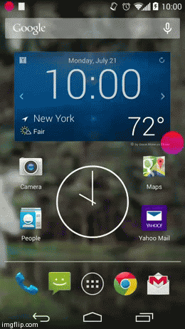

[](https://circleci.com/gh/premnirmal/Magnet)
[](http://search.maven.org/#artifactdetails|com.premnirmal.magnet|library|1.2.7|)
[](http://androidweekly.net/issues/issue-112)
[](https://android-arsenal.com/details/1/1139)

# Magnet

This library enables you to create a window icon similar to Facebooks chat icon, and also similar to the [Link Bubble](https://play.google.com/store/apps/details?id=com.linkbubble.playstore&hl=en) app.
See the demo project for sample implementations.

### Sample play store app:

[](https://play.google.com/store/apps/details?id=com.premnirmal.smoothie)

The library takes care of all the touching and dragging of the window icon, leaving you with callbacks so you can save your time to
implement your app.



## Usage (gradle)

#### Via maven central

``` xml
<dependency>
  <groupId>com.premnirmal.magnet</groupId>
  <artifactId>library</artifactId>
  <version>1.2.7</version>
  <type>aar</type>
</dependency>
```

Add the following to your build.gradle

``` groovy
compile 'com.premnirmal.magnet:library:1.2.7'
compile 'com.facebook.rebound:rebound:0.3.8'
compile 'com.tumblr:backboard:0.1.2'
```

---

## How to create a Magnet

### Use the required permission

``` xml
<uses-permission android:name="android.permission.SYSTEM_ALERT_WINDOW"/>
```

#### Android api level 23+

Request the permission at runtime in your activity, before calling `Magnet#show()`:

``` java
  void checkDrawOverlayPermission() {
    if (Build.VERSION.SDK_INT >= Build.VERSION_CODES.M) {
      if (!Settings.canDrawOverlays(this)) {
        final Intent intent = new Intent(Settings.ACTION_MANAGE_OVERLAY_PERMISSION,
            Uri.parse("package:" + getPackageName()));
        startActivityForResult(intent, REQUEST_CODE);
      } else {
        // continue here - permission was granted
      }
    } else {
      // continue here - permission was granted
    }
  }

  @Override protected void onActivityResult(int requestCode, int resultCode, Intent data) {
    if (requestCode == REQUEST_CODE) {
      if (Settings.canDrawOverlays(this)) {
        // continue here - permission was granted
      }
    }
}
```


### Use the magnet builder in your Activity or Service

``` java

final ImageView iconView = new ImageView(this);
iconView.setImageResource(R.drawable.ic_launcher);
final Magnet magnet = Magnet.newBuilder(this)
        // a view is required
        .setIconView(iconView)
        // all the parameters below are optional
        .setIconCallback(this)
        .setHideFactor(0.2f)
        .setShouldShowRemoveView(true)
        .setRemoveIconShouldBeResponsive(true)
        .setRemoveIconResId(R.drawable.ic_close)
        .setRemoveIconShadow(R.drawable.bottom_shadow)
        .setShouldStickToWall(true)
        .setRemoveIconShouldBeResponsive(true)
        .setInitialPosition(300, 400)
        .withSpringConfig(springConfig)
        .build();
magnet.show();

        ...

magnet.setPosition(200, 800); // to manually move the magnet

        ...

magnet.goToWall(); // to stick the magnet to the wall (only works if shouldStickToXWall or shouldStickToYWall is enabled)

        ...

magnet.destroy(); // to remove the magnet
```

### Subclassing

Instantiate your subclass of `Magnet` using the `Builder`

``` java

final MyMagnet magnet = new Magnet.Builder<MyMagnet>(MyMagnet.class, context)
                        .setIconView(iconView)
                        .build();
```


### Use the callbacks per your needs

``` java
  @Override public void onFlingAway() {
    Log.i(TAG, "onFlingAway");
  }

  @Override public void onMove(float x, float y) {
    Log.i(TAG, "onMove(" + x + "," + y + ")");
  }

  @Override public void onIconClick(View icon, float iconXPose, float iconYPose) {
    Log.i(TAG, "onIconClick(..)");
  }

  @Override public void onIconDestroyed() {
    Log.i(TAG, "onIconDestroyed()");
  }
```

---

## API Requirements

- The minimum supported Android version is Android 4.0 Ice cream sandwich (API Level 14)
- Requires the permission `android.permission.SYSTEM_ALERT_WINDOW`

## Dependencies

- [rebound](http://facebook.github.io/rebound)
- [backboard](https://github.com/tumblr/Backboard)

## Contributing

Please fork this repository and contribute back using [pull requests](https://github.com/premnirmal/Magnet/pulls).

## License

```
WWWWWW||WWWWWW
 W W W||W W W
      ||
    ( OO )__________
     /  |           \
    /o o|    MIT     \
    \___/||_||__||_|| *
         || ||  || ||
        _||_|| _||_||
       (__|__|(__|__|

The MIT License (MIT)

Copyright (c) 2014 Prem Nirmal

Permission is hereby granted, free of charge, to any person obtaining a copy
of this software and associated documentation files (the "Software"), to deal
in the Software without restriction, including without limitation the rights
to use, copy, modify, merge, publish, distribute, sublicense, and/or sell
copies of the Software, and to permit persons to whom the Software is
furnished to do so, subject to the following conditions:

The above copyright notice and this permission notice shall be included in all
copies or substantial portions of the Software.

THE SOFTWARE IS PROVIDED "AS IS", WITHOUT WARRANTY OF ANY KIND, EXPRESS OR
IMPLIED, INCLUDING BUT NOT LIMITED TO THE WARRANTIES OF MERCHANTABILITY,
FITNESS FOR A PARTICULAR PURPOSE AND NONINFRINGEMENT. IN NO EVENT SHALL THE
AUTHORS OR COPYRIGHT HOLDERS BE LIABLE FOR ANY CLAIM, DAMAGES OR OTHER
LIABILITY, WHETHER IN AN ACTION OF CONTRACT, TORT OR OTHERWISE, ARISING FROM,
OUT OF OR IN CONNECTION WITH THE SOFTWARE OR THE USE OR OTHER DEALINGS IN THE
SOFTWARE.
```


---

### Author
[Prem Nirmal](http://premnirmal.me/)
